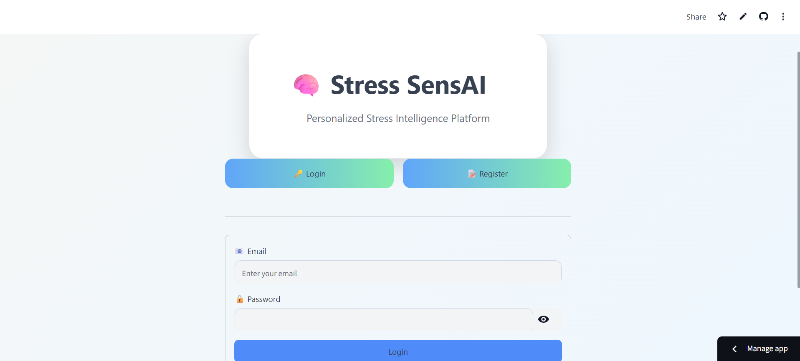
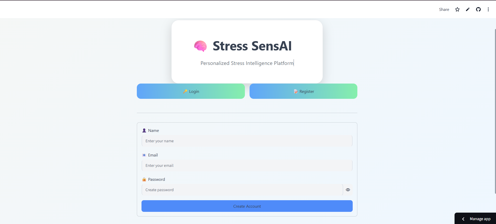
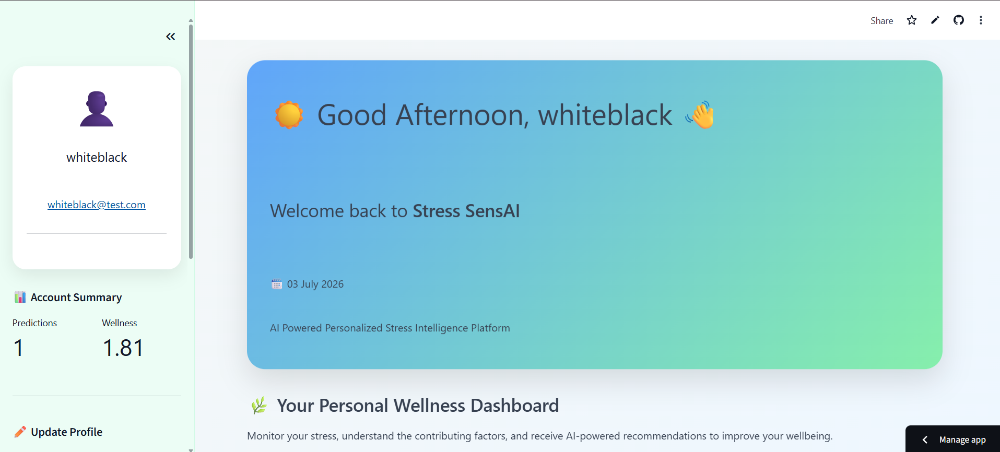
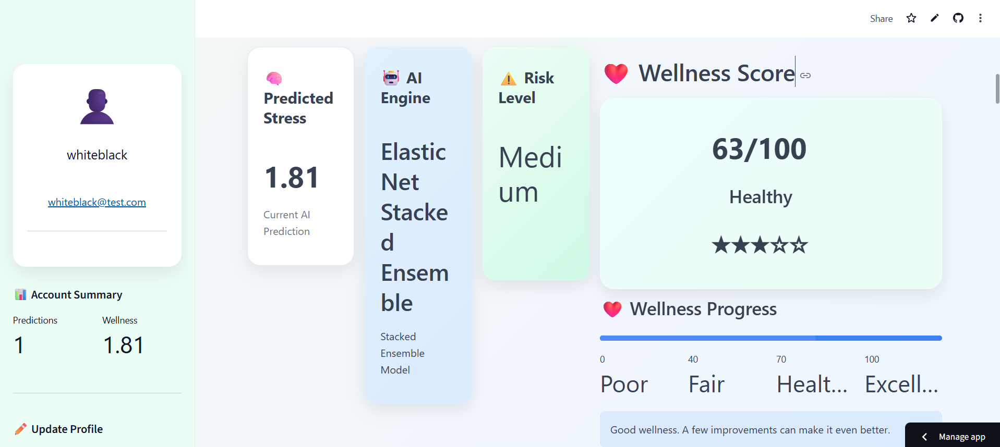
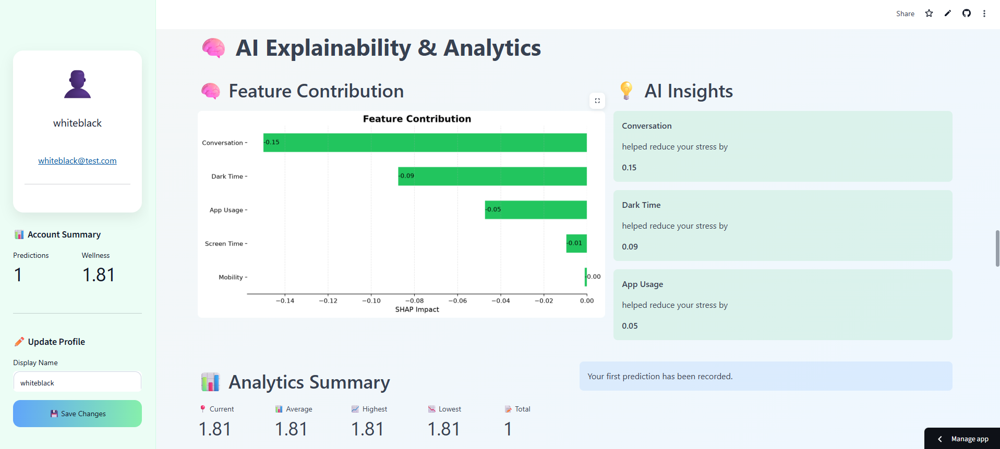
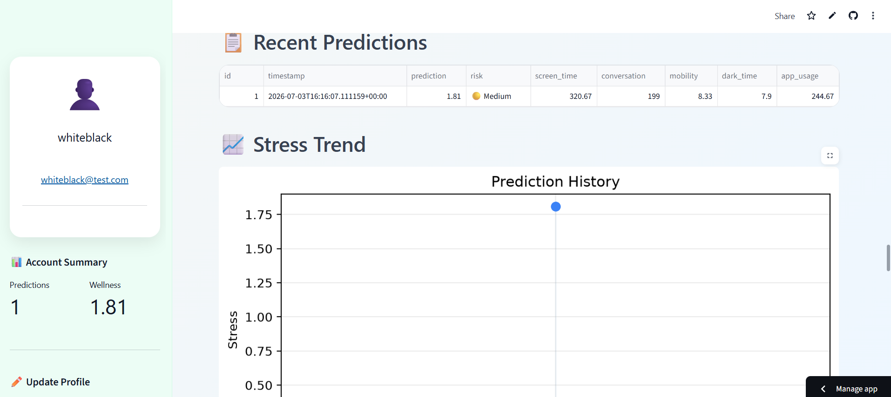
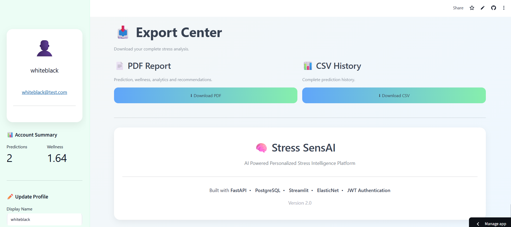

<div align="center">

# 🧠 Stress SensAI

### AI-Powered Personalized Stress Intelligence Platform

##
Predict • Analyze • Understand • Improve
[](https://stress-sensai.streamlit.app/)
[](https://stress-sensai.onrender.com)
[](https://stress-sensai.onrender.com/docs)

</div>

---

## 📌 Overview

Stress SensAI is a production-inspired full-stack AI platform that predicts stress levels from digital behavioral patterns and provides personalized wellness insights.

The platform combines modern software engineering practices with ensemble machine learning to deliver secure authentication, cloud-hosted APIs, interactive analytics, and explainable AI predictions.

Built as a complete end-to-end system, Stress SensAI demonstrates how machine learning models can be integrated into scalable web applications using modern backend, frontend, database, containerization, and cloud deployment technologies.

---

# 🚀 Live Demo

| Service | URL |
|---------|-----|
| 🌐 Frontend | https://stress-sensai.streamlit.app/ |
| ⚡ Backend API | https://stress-sensai.onrender.com |
| 📖 Swagger Documentation | https://stress-sensai.onrender.com/docs |

> **Note:** The backend is hosted on Render's free tier. If the service has been idle, the first request may take around 30–60 seconds while it starts.
> **Note:** The frontend is hosted on streamlit's community cloud free tier. If the service has been idle, the starting may ask to get this app back up.

---

# ✨ Features

## 🤖 Artificial Intelligence

- Ensemble Machine Learning pipeline
- Explainable AI using SHAP
- Real-time stress prediction
- Personalized wellness insights
- Risk classification

---

## 🔐 Authentication & Security

- JWT-based authentication
- Argon2 password hashing
- Protected API endpoints
- Secure password storage

---

## 📊 Analytics

- Interactive dashboard
- Historical prediction tracking
- Trend visualization
- Personalized analytics

---

## 🗄 Database

- PostgreSQL
- SQLAlchemy ORM
- Alembic migrations
- Cloud-hosted Neon database

---

## ☁ Deployment

- Dockerized backend
- Docker Compose
- Render deployment
- Streamlit Community Cloud
- Environment variable configuration

---

# 📸 Application Screenshots

The following screenshots demonstrate the complete workflow of Stress SensAI.

---

## 🔐 User Authentication

### Login



Secure JWT-based user login with encrypted password authentication.

---

### Register



Simple user registration with secure credential storage using Argon2 password hashing.

---

## 🏠 Dashboard



Interactive dashboard for entering behavioral metrics and receiving AI-powered stress predictions.

---

## 🤖 Stress Prediction



Real-time stress prediction generated using an ensemble machine learning model.

---

## 📊 Analytics Dashboard



Visual analytics showing historical trends and stress insights.

---

## 📜 Prediction History



Complete history of previous predictions stored securely in PostgreSQL.

---

## 📄 PDF Report



Downloadable report summarizing prediction results and recommendations.

---

# 🏗️ System Architecture

```text
                        User
                          │
                          ▼
              Streamlit Community Cloud
                          │
                     HTTPS REST API
                          │
                          ▼
                 FastAPI Backend (Render)
                          │
          JWT Authentication Middleware
                          │
                 SQLAlchemy ORM
                          │
                Alembic Database Migrations
                          │
                          ▼
               Neon PostgreSQL Database
                          │
                          ▼
              AI Prediction Service
         ┌─────────────┬─────────────┬─────────────┬─────────────┐
         ▼             ▼             ▼             ▼
    ElasticNet      CatBoost      LightGBM      XGBoost
                          │
                          ▼
                  SHAP Explainability
                          │
                          ▼
               Personalized Stress Insights
```

---

# 🧠 Machine Learning Pipeline

The prediction engine follows a structured machine learning workflow:

```text
User Behaviour Data
        │
        ▼
Input Validation
        │
        ▼
Feature Engineering
        │
        ▼
Data Scaling
        │
        ▼
Ensemble Prediction Model
   ├── ElasticNet
   ├── CatBoost
   ├── LightGBM
   └── XGBoost
        │
        ▼
Stress Score
        │
        ▼
Risk Classification
        │
        ▼
SHAP Explainability
        │
        ▼
Personalized Recommendations
```

### Models Used

| Model | Purpose |
|--------|---------|
| ElasticNet | Linear baseline prediction |
| CatBoost | Gradient boosting for categorical relationships |
| LightGBM | Fast gradient boosting |
| XGBoost | Meta learner for ensemble prediction |
| SHAP | Model explainability and feature importance |

---

# 💡 Why Stress SensAI?

Mental health is an increasingly important aspect of overall well-being, yet many existing solutions focus only on symptom tracking.

Stress SensAI explores how everyday digital behavioral patterns—such as screen time, mobility, application usage, and communication activity—can be leveraged with machine learning to estimate stress levels and provide meaningful insights.

The project demonstrates the integration of modern software engineering practices with applied artificial intelligence, resulting in a scalable, secure, and cloud-deployed application.

---

# 🛠 Tech Stack

| Category | Technology |
|----------|------------|
| Programming Language | Python 3.12 |
| Frontend | Streamlit |
| Backend | FastAPI |
| Database | PostgreSQL (Neon) |
| ORM | SQLAlchemy |
| Database Migration | Alembic |
| Authentication | JWT + Argon2 |
| Machine Learning | ElasticNet, CatBoost, LightGBM, XGBoost |
| Explainable AI | SHAP |
| Data Processing | Pandas, NumPy |
| Visualization | Plotly, Matplotlib |
| Containerization | Docker, Docker Compose |
| Backend Deployment | Render |
| Frontend Deployment | Streamlit Community Cloud |
| Version Control | Git & GitHub |

---

# 📁 Project Structure

```text
Stress-SensAI
│
├── App_backend/
│   ├── alembic/
│   ├── models/
│   ├── training/
│   ├── app.py
│   ├── auth.py
│   ├── database.py
│   ├── models.py
│   ├── security.py
│   ├── requirements.txt
│   └── Dockerfile
│
├── App_frontend/
│   ├── .streamlit/
│   ├── dashboard.py
│   ├── auth.py
│   ├── api.py
│   ├── requirements.txt
│   └── Dockerfile
│
├── docs/
│   ├── screenshots/
│   ├── architecture/
│   └── assets/
│
├── docker-compose.yml
├── README.md
└── .gitignore
```

---

# ⚙ Installation

## Clone the Repository

```bash
git clone https://github.com/Konarkpreserve/Stress-SensAI.git

cd Stress-SensAI
```

---

## Backend Setup

```bash
cd App_backend

python -m venv venv

source venv/bin/activate
```

Windows

```cmd
venv\Scripts\activate
```

Install dependencies

```bash
pip install -r requirements.txt
```

---

## Frontend Setup

```bash
cd ../App_frontend

pip install -r requirements.txt
```

---

# 🐳 Running with Docker

Build the containers:

```bash
docker compose build
```

Start all services:

```bash
docker compose up
```

Run in detached mode:

```bash
docker compose up -d
```

Stop the application:

```bash
docker compose down
```

The application starts:

- Backend → http://localhost:8000
- Frontend → http://localhost:8501
- PostgreSQL → localhost:5432

---

# ☁ Cloud Deployment

Stress SensAI is deployed using a modern multi-service cloud architecture.

| Component | Platform |
|----------|----------|
| Frontend | Streamlit Community Cloud |
| Backend | Render |
| Database | Neon PostgreSQL |

### Deployment Workflow

1. Push changes to GitHub.
2. Render automatically deploys the FastAPI backend.
3. Streamlit Community Cloud deploys the frontend.
4. Neon provides the managed PostgreSQL database.

---

# 🔑 Environment Variables

## Backend

Create an `.env` file in `App_backend`.

```env
DATABASE_URL=

SECRET_KEY=

ALGORITHM=HS256

ACCESS_TOKEN_EXPIRE_MINUTES=60
```

---

## Frontend

For Streamlit Community Cloud:

```toml
BACKEND_URL = "https://your-backend-url.onrender.com"
```

---

# 🚀 REST API

| Method | Endpoint | Description |
|--------|----------|-------------|
| POST | `/register` | Register a new user |
| POST | `/login` | Authenticate user |
| GET | `/profile` | Retrieve user profile |
| PUT | `/profile` | Update user profile |
| POST | `/predict` | Generate a stress prediction |
| GET | `/history` | Retrieve prediction history |
| GET | `/analytics` | Retrieve analytics data |
| POST | `/simulate` | Run what-if simulation |
| GET | `/health` | Service health check |
| GET | `/docs` | Swagger API documentation |

---

# 🗺️ Future Roadmap

The following enhancements are planned for future versions of Stress SensAI.

## Version 1.1

- Email verification
- Password reset
- Profile picture support
- Better PDF reports
- Improved dashboard UI

---

## Version 1.2

- Google OAuth Login
- Personalized notification system
- User preferences
- Dark mode support
- Export analytics to CSV

---

## Version 2.0

- Mobile application
- Wearable device integration
- Continuous stress monitoring
- AI chatbot for wellness guidance
- Model retraining pipeline
- Admin dashboard
- Multi-language support

---

# 📚 Lessons Learned

Developing Stress SensAI provided practical experience beyond machine learning by exposing real-world software engineering challenges.

Key learnings include:

- Designing secure REST APIs using FastAPI.
- Implementing JWT authentication and password hashing.
- Managing relational databases with PostgreSQL and SQLAlchemy.
- Version-controlling database schemas using Alembic.
- Containerizing applications using Docker and Docker Compose.
- Deploying distributed services across Render, Streamlit Community Cloud, and Neon.
- Managing environment variables securely for local and production environments.
- Debugging deployment, networking, and database migration issues.
- Integrating machine learning models into a production-inspired web application.

---

# 🔒 Security

Stress SensAI follows several security best practices.

- Passwords are hashed using Argon2.
- Authentication is implemented using JWT access tokens.
- Protected endpoints require valid authentication.
- Environment variables are used for sensitive configuration.
- Database credentials are never committed to the repository.
- Passwords are never stored in plain text.

---

# 📄 License

This project is licensed under the MIT License.

See the LICENSE file for more information.

---

# 👨‍💻 Author

## Konark Sahu

Final Year B.Tech Computer Science Engineering Student

### Connect with me

- GitHub: https://github.com/Konarkpreserve
- Project Repository: https://github.com/Konarkpreserve/Stress-SensAI

If you have suggestions, feedback, or ideas for improving Stress SensAI, feel free to open an issue or submit a pull request.

---

# 🙏 Acknowledgements

This project was built as part of my journey to deepen my understanding of software engineering, machine learning, cloud deployment, and production-ready application development.

Special thanks to the open-source community for the excellent tools and libraries that made this project possible.